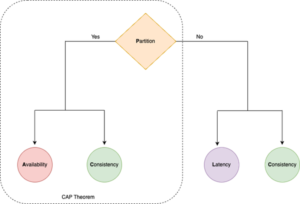

# How to approach a System Design Problem?

1. Be curious and question the ask like an end user (or admin)
    1. What is important for the user?
    2. How would the user use the system? What is the workflow?
    3. What is unknown to you (solutions architect)? Ask it out.
2. Question thoroughly to reduce scope.
	1. Do not design a system that susprises the client. They expect a certain solution (esp in an interview)
3. Is this a breadth or depth oriented problem? Design uber vs distributed cache
4. Is this a read or write heavy application?
5. Are there real-time needs? Many applications are real-time now.
6. Derive the high level design. 
    1. As you are doing this, discuss trade-offs. 
    2. Do not assume decisions (even if you think it is trivial) and move forward. For example, in a rate limiter problem, it is common to assume server side rate limit. But ask the interviewer if that is what he/she wants.
    3. Discuss other trade-offs like SQL vs NoSQL etc.
7. Discuss with the interviewer if it is good so far
8. Walk-through the design as if the client is using the system. This will help you catch gaps.
    1. Like resetting the counter in a API rate limiter problem at the end of the time window
    2. How can the client study the effectiveness of the system. Do they need logging and analytics?
    3. Ask the interviewer if anything that you found in this walk-through is important for them.  
9. High level design - Ask interviewer what to focus on
    1. Explore Db schema (depending on the problem)
    2. API design
    3. Address scalability. Always call out trade-offs when you scale.

# System Design Trade-offs

1. Time vs Space (as in algorithms)
2. Latency vs throughput
    1. Response time = latency + processing time
    2. Throughput vs bandwidth
    3. Example: more latency, increased queue in network, reduced packets are processed, leading to lower throughput
3. Performance vs Scalability
    1. Performance: Slow for even a single user
    2. Scalability: Slow under load for users
4. Consistency vs Availability: CAP
5. PACELC
    1. Nuanced version of CAP
    2. In the case of network partitioning (P) in a distributed computer system, one has to choose between availability (A) and consistency (C) (as per the CAP theorem), but else (E), even when the system is running normally in the absence of partitions, one has to choose between latency (L) and consistency (C). 
    3. If the system tries to provide for strong consistency, it has to do replication with synchronous communication and blocking to ensure all the read replicas receive the most recent write, waiting on the acknowledgement from all the replica nodes, adding to high latency. On the other hand, if the system does asynchronous replication without waiting for acknowledgment from all nodes, it will end up providing eventual consistency when the replica node has acknowledged the data mutation change for serving the requests. 
    4. 

# System Design Cheat Sheet from ByteByteGo

# Architectural Patterns and Techniques

<table>
  <tr>
   <td><strong>Context</strong></td>
   <td><strong>Application</strong></td>
   <td><strong>Data</strong></td>
  </tr>

<tr>
<td>Scalability</td>
<td>Load balance. Scalability testing for load spikes</td>
<td>Caching, Partioning, Sharding</td>
</tr>

<tr>
<td>Reliability</td>
<td>Long running Soak tests to detect unwanted behavior over time like memory leaks</td>
<td>abc</td>
</tr>

<tr>
<td>Availability</td>
<td>Redundancy, Fault tolerance</td>
<td>Replication</td>
</tr>

<tr>
<td>Performance</td>
<td>FE, BE approaches. Cache, minify, zip, CDN, bundle, Parallel calls, async calls, avoid locks</td>
<td>Shard/Partition, Avoid scatter gather, Cache</td>
</tr>

</table>
