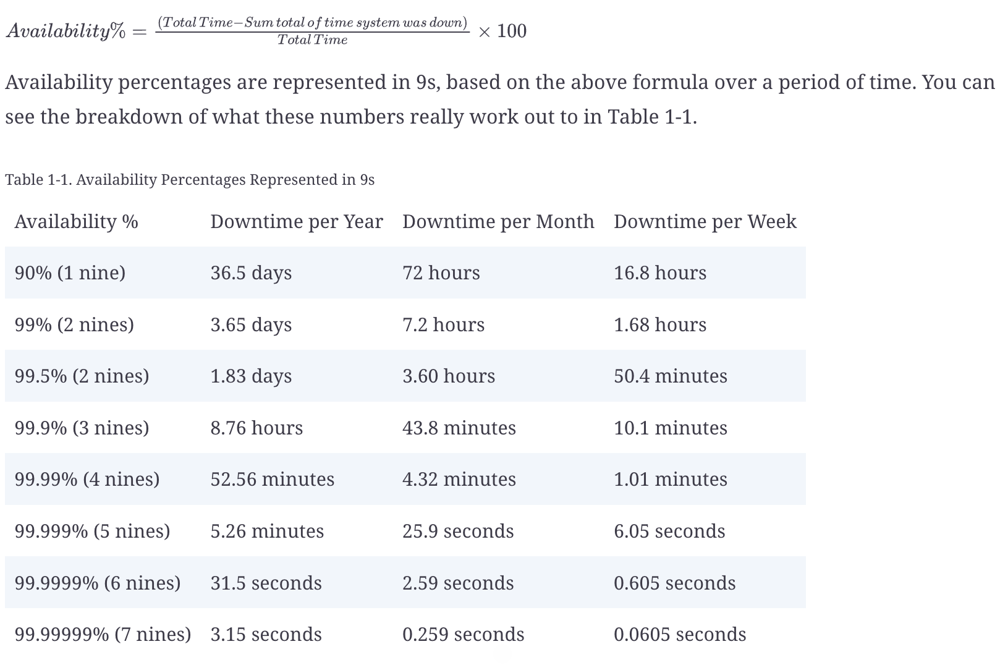

# Availability

## Availability 9s

## Techniques to improve availability
1. Redundancy
2. Fault Tolerance
    1. Replication based fault tolerance: replicate data, service, servers, and location etc
    2. Checkpointing based fault tolerance: data is reliably stored and backed up. 
        1. Allows system recovery from data loss. 
        2. Synchronous vs Asynchronous
3. Load balancing

## Availability Patterns
Failover Patterns:
1. Active-active failover
2. Active-passive failover

Replication patterns:
1. Multi-leader replication
    1. all systems are able to both read and write data
    2. Most multi leader systems are either loosely consistent or have increased write latency due to synchronization to remain consistent.
2. Single-leader replication
    1. Risk of data loss
