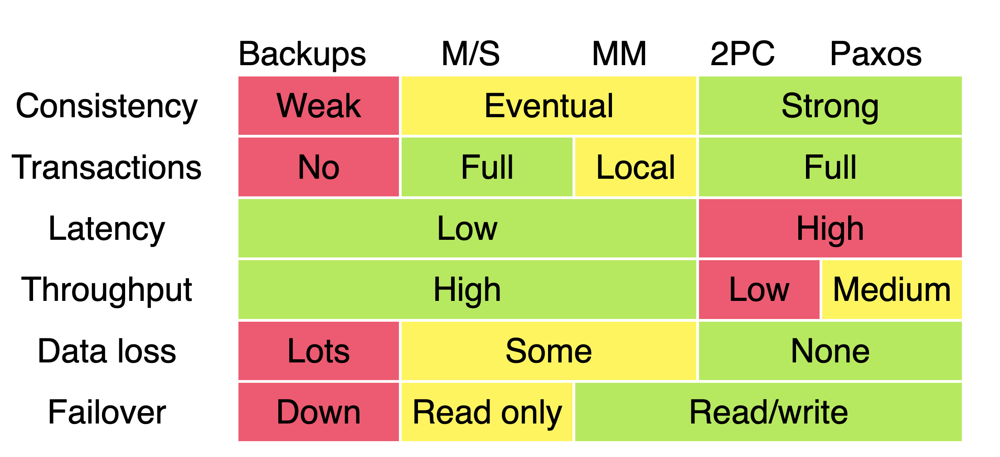

# Consistency

- Be consistent in accordance with a set of rules or standards.
- Consistency contexts:
  - Distributed Consistency: state or property of replicas or servers have the same view of the data at a given point of time i.e., replicas have the same data
  - Storage & retrieval Consistency: Each read returns value of most recent write.

## Tangent on Linearizability vs Serializability

<table>
  <tr>
   <td><strong>Linearizability</strong></td>
   <td><strong>Serializability</strong></td>
  </tr>
  <tr>
   <td>
<ul>
<li>State of replicas as if there is only 1 replica
<li>Ex: 2 phase commit to achieve this
<li>More of a consistency/consensus concept
</li>
</ul>
   </td>
   <td>
<ul>
<li>Transaction isolation (Race between parallel transactions)
<li>Ex: 2 phased lock to achieve this
<li>More of an isolation/atomicity concept
<li>Serializable snapshot isolation
</li>
</ul>
   </td>
  </tr>
</table>

## Consistency Techniques
Techniques in distributed systems to ensure <b>data</b> consistency:
1. Data replication
2. Consensus protocol
3. Conflict resolution

Techniques in data storage to ensure <b>read</b> consistency:
1. Write-ahead logging
2. Locking
3. Data versioning

## Consistency Spectrum Models

(Sorted by strongest to weakest)

1. Linearizability
   1. Strongest
   2. Write visible to all exactly at once
   3. No partial or side effects
   4. How is it achieved? Consensus based
   5. Cons: Difficult to achieve in practice as it requires all nodes to be in constant communication.
2. Sequential
   1. Based on ordering
3. Causal
   1. Causally-related (dependent) operations are seen in the same order by all
   2. Preserves the order of the causally-related operations i.e., if operation A must happen before operation B, then all processes in the system will see A before they see B
   3. How is it achieved? Logical clocks, version vector
4. Session model
   1. Read own writes
   2. Monotonic reads: Once read, all subsequent reads from that client will return same value or more recent value. Client will "not" see stale data.
   3. Monotonic writes: Once a write operation has been acknowledged by a replica node, all subsequent reads from that replica node will return the updated value. Replica will "not" return stale data
   4. Write follows read
5. Eventual
   1. Updates are propagated asynchronously
   2. Need conflict resolution like last write wins or vector clocks
   3. CAP trade: A for C or vice-versa
   4. Pros: Allows for more flexibility and tolerance of delays or failures, but 
   5. Cons: can result in temporary inconsistencies in the data.
6. Tunable
   1. R+W>N
   2. Write heavy: W=1, R=N
7. Strong eventual consistency (?)
   1. CRDT prevents conflict and allow any order

## Linearizability Deep Dive

- Linearizability = One replica effect
- Atomic consistency
- Strong consistency
- Immediate consistency
- Recency guarantee
- Strong single-object single-operation model
- Writes visible to all readers exactly once at some point in time
- When/why is linearizability needed?
  - Leader election
  - Uniqueness constraints
  - Cross channel timing
- What can be linearized?
  - Single leader (maybe)
  - Consensus (yes)
  - Multi-leader (no)
  - Leaderless (probably not)
- How is it achieved?
  - 2 Phased commit
  - Consensus
- Cons
  - Linearizability is C in CAP
  - Affects performance.

### Linearizability and Ordering

- Linearizability implies ordering
- Achieved using timestamp and clocks
- Why is ordering important?
  - Preserves causality
  - Detects concurrent writes
- Concurrent operations are incomparable. So causality is partial order
- Causality is hard. So use sequence number of timestamp
- Sequence number ordering
  - Pregenerate blocks
  - odd/even combo
  - Attach timestamps (LWW)
  - Lamport timestamp
  - Total order broadcast like in Zookeeper

## Achieving Consistency using Anti-entropy Techniques

Aim is to bring the nodes back up to date.

1. Read repair
   1. Coordinator fixes diff/missed updates
   2. Blocking or asynchronous
2. Digest reads
   1. Same as above + coordinator does digest checks instead of full read check
3. Hinted handoff
   1. If write fails, diff is stored as hint and replayed to target node by write coordinator
4. Merkle trees
   1. Hash of local data -> Tree of hashes
   2. Compare trees quickly
5. Bitmap version vector
   1. Recency based
   2. Maintain logs
   3. Compare logs
6. Gossip
   1. Uses gossip protocol
   2. Cooperative propagation to disseminate information

## Transactions across Datacenters by Ryan Barrett

- Main deck: https://snarfed.org/transactions_across_datacenters_io.html
- Summary of consistency across various scenarios. 

[Replication](replication.md) | [Partitioning](partitioning.md) | [Transactions](transaction.md) | [Isolation](isolation.md) | [Consistency](consistency.md) | [Distributed Transactions](distributed_transactions.md) | [Consensus](consensus.md)
